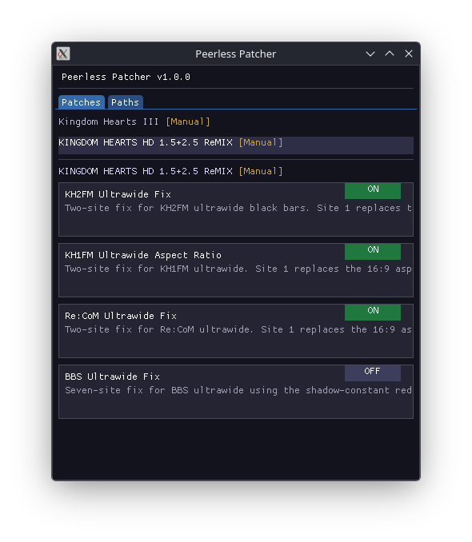
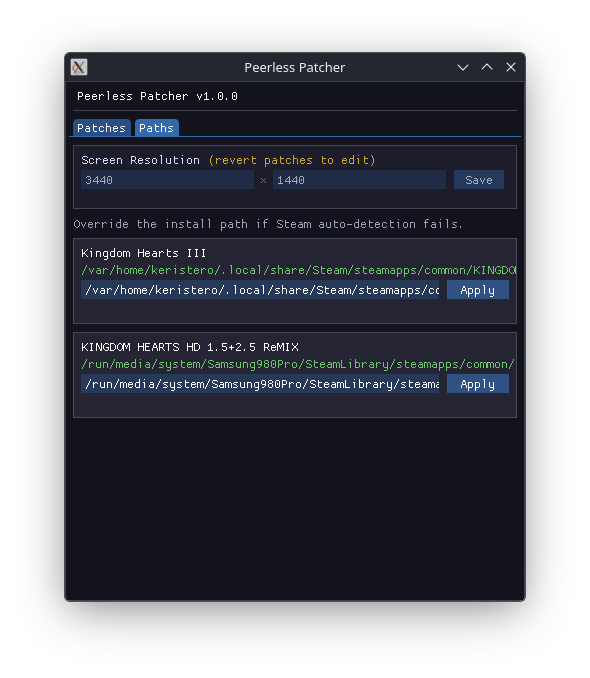

# Peerless Patcher




I wanted to play kingdom hearts 3 so I figured I'd use AI to help create a tool for applying the ultrawide patches easily.

Applies and reverts game patches for Steam games. Useful for ultrawide fixes and other exe edits. Run it alongside your game and toggle patches on or off.
But most patches wont apply while the game is running.

## Features

- `file-hex-edit` - patches a game exe or data file on disk, reversible
- `file-replace` - swaps a game file with a bundled asset, backs up the original
- `hex-edit` - writes bytes to process memory, reverts automatically when the game exits
- JSON profiles - add a new game by dropping a JSON file, no recompile needed
- Screen resolution saved per machine, patches adapt to your aspect ratio
- Manual install path override if Steam auto-detection fails

## Status
- I've only tested the first few minutes of gameplay in every game, if you have any issues report them in issues or something, try to include as much detail as you can, as well as what platform you are on.
- I've only tested on bazzite linux using proton, with 3440x1440 patches so far, it should work for other screen aspect ratios also, but im not sure.
- KH2FM, KH1FM, Re:CoM: two-site patches (AR float + FOV denominator). BBS uses a shadow-constant redirect technique to patch projection without affecting UI bounds.


## Bundled Profiles

| Game | Steam App ID | Patch |
|------|-------------|-------|
| Kingdom Hearts III | 897780 | Ultrawide aspect ratio (7 hardcoded 16:9 constants in the exe) |
| Kingdom Hearts HD 1.5+2.5 ReMIX — KH2 Final Mix | 2552430 | Ultrawide fix: AR float + FOV denominator (two-site patch) |
| Kingdom Hearts HD 1.5+2.5 ReMIX — KH1 Final Mix | 2552430 | Ultrawide fix: AR float + FOV denominator (two-site patch) |
| Kingdom Hearts HD 1.5+2.5 ReMIX — Re:Chain of Memories | 2552430 | Ultrawide fix: AR float + FOV denominator (two-site patch) |
| Kingdom Hearts HD 1.5+2.5 ReMIX — Birth by Sleep | 2552430 | Ultrawide fix: shadow-constant redirect (seven-site patch, UI preserved) |

## Downloads

Builds are produced by CI on every push to `main` and on `v*` tag releases.

| Platform | Download |
|----------|---------|
| Windows x64 | `PeerlessPatcher-windows-x64.zip` from [Releases](../../releases) |
| Linux x64 | `PeerlessPatcher-linux-x64.AppImage` from [Releases](../../releases) |

## Credits

Thanks to the KH community for their combined efforts, I pulled most of the hex editing information from the PC Gaming Wiki and KH-ReFined
Claude Sonnet 4.6 did the rest


## Running

**Windows:** extract the zip and run `PeerlessPatcher.exe`. Administrator is only needed for `hex-edit` (live memory) patches.

**Linux:**
```bash
chmod +x PeerlessPatcher-linux-x64.AppImage
./PeerlessPatcher-linux-x64.AppImage
```

1. Open the patcher.
2. Toggle patches on in the Patches tab.
3. Launch your game.
4. To revert, toggle patches off.

Note: if Steam runs Verify File Integrity, it will revert any patched files. Just re-apply them.

## Dev Setup

Uses [mise](https://mise.jdx.dev/) to pin the .NET SDK version.

```bash
curl https://mise.run | sh
git clone https://github.com/youruser/peerless-patcher
cd peerless-patcher
mise trust && mise install
```

## Building

```bash
mise run build:windows   # dist/win-x64/
mise run build:linux     # dist/linux-x64/
mise run test
```

## Adding a Game Profile

See [`profiles/README.md`](profiles/README.md) for the full schema. For advanced cases where a single constant is shared between 3D projection and UI code, see [`profiles/assets/shadow-constant-redirect.md`](profiles/assets/shadow-constant-redirect.md).

```json
// profiles/<steamAppId>.json
{
  "gameId": "my-game",
  "gameName": "My Game",
  "steamAppId": 123456,
  "installDir": "My Game",
  "processName": "MyGame",
  "patches": [
    {
      "type": "file-hex-edit",
      "name": "Ultrawide Support",
      "description": "Patches 16:9 aspect ratio to 21:9.",
      "filePath": "MyGame/Binaries/Win64/MyGame.exe",
      "offset": -1,
      "findBytes": [57, 142, 227, 63],
      "replaceBytes": [85, 85, 21, 64]
    }
  ]
}
```

Drop the file in `profiles/` next to the executable and restart the patcher.

## Patch Types

| Type | Target | Reversible | Notes |
|------|--------|------------|-------|
| `file-hex-edit` | File on disk | Yes | Scans whole file if `offset: -1` |
| `file-replace` | File on disk | Yes | Backs up original as `<file>.sgp.bak` |
| `hex-edit` | Process memory | Auto on exit | Requires Admin on Windows |

## Notes

- Steam Verify File Integrity will revert file patches. Re-apply after a game update.
- `hex-edit` requires Administrator on Windows.
- On Linux/Proton, `hex-edit` needs `ptrace` access. `file-hex-edit` works without elevated privileges.

